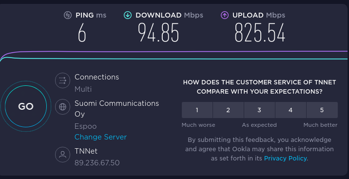

# Konffivika

> teille olisi nyt allokoitu seuraavat IPv4/IPv6 -osoitteet:
>
> IPv4 89.236.117.70/255.255.255.192, gw 89.236.117.65
> DNS 217.112.240.21 89.236.110.2
>
> IPv6 2001:40e8:0000:0017:0089:0236:0117:0070/64, gw 2001:40e8:0:17::1
> DNS 2001:40e8:0:10::11 2001:40e8:10:12:89:236:110:2

Ylläolevat osoitteet ei siis toimi, dhcp toimii. 
